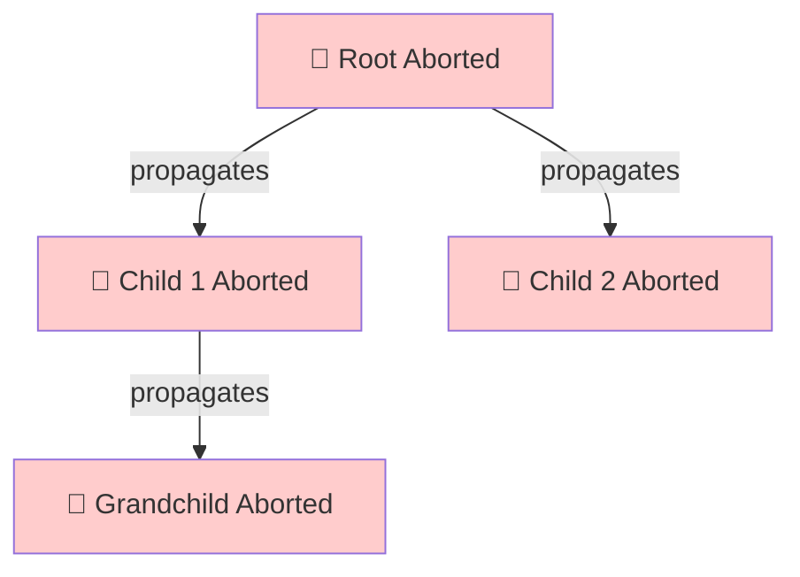

## Understanding AbortSignal

Every scope in go-go-scope has an `AbortSignal` that propagates cancellation to all child tasks. This signal is based on the standard [AbortController API](https://developer.mozilla.org/en-US/docs/Web/API/AbortController).

### Basic Cancellation

```typescript
import { scope } from 'go-go-scope';

await using s = scope();

const task = s.task(async ({ signal }) => {
  // Check if already cancelled
  if (signal.aborted) {
    throw new Error('Task was cancelled');
  }
  
  // Listen for cancellation
  signal.addEventListener('abort', () => {
    console.log('Task cancelled:', signal.reason);
  });
  
  // Long-running operation
  await longOperation(signal);
});

// Manually dispose scope to trigger cancellation
await s[Symbol.asyncDispose]();
// Output: "Task cancelled: Error: Scope disposed"
```

<Note>
The `signal` parameter is automatically provided to every task. Always pass it to async operations that support cancellation (like `fetch`).
</Note>

## Automatic Cancellation Scenarios

go-go-scope automatically cancels tasks in several scenarios:

### 1. Scope Timeout

```typescript
await using s = scope({ timeout: 1000 }); // 1 second timeout

const task = s.task(async ({ signal }) => {
  signal.addEventListener('abort', () => {
    console.log('Timed out!');
  });
  
  // This will be cancelled after 1 second
  await new Promise(resolve => setTimeout(resolve, 5000));
});

await task;
// After 1 second: "Timed out!"
```

### 2. Scope Disposal

```typescript
async function handleRequest() {
  await using s = scope();
  
  s.task(async ({ signal }) => {
    signal.addEventListener('abort', () => {
      console.log('Request ended, task cancelled');
    });
    
    await infiniteLoop();
  });
  
  // When function exits, scope is disposed
  // All tasks are automatically cancelled
}
```

### 3. Parent Signal Abort

```typescript
const parentController = new AbortController();

await using s = scope({ 
  signal: parentController.signal 
});

s.task(async ({ signal }) => {
  signal.addEventListener('abort', () => {
    console.log('Parent aborted!');
  });
  
  await longOperation();
});

// Aborting parent automatically cancels scope and all tasks
parentController.abort();
```

### 4. Task-Specific Timeout

```typescript
await using s = scope();

const task = s.task(async ({ signal }) => {
  signal.addEventListener('abort', () => {
    console.log('Task timeout!');
  });
  
  await slowOperation();
}, {
  timeout: 2000 // Task-specific 2 second timeout
});

await task;
```

## Cancellation Propagation Tree

Cancellation flows down the scope hierarchy:

```typescript
await using root = scope({ name: 'root', timeout: 5000 });
const child1 = root.createChild({ name: 'child-1' });
const child2 = root.createChild({ name: 'child-2' });
const grandchild = child1.createChild({ name: 'grandchild' });

// All scopes listen to parent signals
root.signal.addEventListener('abort', () => 
  console.log('Root aborted'));
child1.signal.addEventListener('abort', () => 
  console.log('Child 1 aborted'));
grandchild.signal.addEventListener('abort', () => 
  console.log('Grandchild aborted'));

// After 5 seconds (root timeout):
// "Root aborted"
// "Child 1 aborted"
// "Grandchild aborted"
```

**Propagation diagram:**



## Cancellation Utilities

go-go-scope provides utility functions for working with `AbortSignal`:

**Source location:** `/home/daytona/workspace/source/packages/go-go-scope/src/cancellation.ts:1-149`

### onAbort

Register a callback for when the signal aborts:

```typescript
import { onAbort } from 'go-go-scope';

await using s = scope();

const task = s.task(async ({ signal }) => {
  // Register cleanup that runs on abort
  using cleanup = onAbort(signal, (reason) => {
    console.log('Cleaning up because:', reason);
  });
  
  try {
    await longOperation();
  } finally {
    // Cleanup is automatically unregistered here
    cleanup[Symbol.dispose]();
  }
});
```

### abortPromise

Create a promise that rejects when signal aborts:

```typescript
import { abortPromise } from 'go-go-scope';

await using s = scope({ timeout: 1000 });

const task = s.task(async ({ signal }) => {
  // Race operation against cancellation
  const result = await Promise.race([
    fetchData(),
    abortPromise(signal) // Rejects when signal aborts
  ]);
  
  return result;
});
```

### whenAborted

Wait for signal to abort:

```typescript
import { whenAborted } from 'go-go-scope';

await using s = scope();

const task = s.task(async ({ signal }) => {
  // Start background work
  const worker = startBackgroundWork();
  
  // Wait for cancellation
  await whenAborted(signal);
  
  // Cleanup when cancelled
  worker.stop();
  console.log('Task cancelled gracefully');
});

await s[Symbol.asyncDispose]();
```

<Tip>
Use `whenAborted` for graceful shutdown patterns where you need to perform cleanup after receiving cancellation signal.
</Tip>

## Real-World Cancellation Patterns

### Pattern 1: HTTP Request with Cancellation

```typescript
import { scope } from 'go-go-scope';

async function fetchWithCancellation(url: string, timeoutMs: number) {
  await using s = scope({ timeout: timeoutMs });
  
  const [err, data] = await s.task(async ({ signal }) => {
    // Pass signal to fetch for automatic cancellation
    const response = await fetch(url, { signal });
    return response.json();
  });
  
  if (err) {
    if (err.name === 'AbortError') {
      throw new Error(`Request cancelled or timed out after ${timeoutMs}ms`);
    }
    throw err;
  }
  
  return data;
}

// Usage
try {
  const data = await fetchWithCancellation('https://api.example.com/data', 5000);
  console.log(data);
} catch (err) {
  console.error('Request failed:', err.message);
}
```

### Pattern 2: Polling with Cancellation

```typescript
import { scope } from 'go-go-scope';

async function pollUntilReady(checkUrl: string, maxAttempts: number = 10) {
  await using s = scope({ timeout: 60000 }); // 1 minute max
  
  const [err, result] = await s.task(async ({ signal }) => {
    for (let attempt = 0; attempt < maxAttempts; attempt++) {
      // Check if cancelled
      if (signal.aborted) {
        throw new Error('Polling cancelled');
      }
      
      // Check status
      const response = await fetch(checkUrl, { signal });
      const status = await response.json();
      
      if (status.ready) {
        return status;
      }
      
      // Wait before next attempt (respect cancellation)
      await new Promise((resolve, reject) => {
        const timeoutId = setTimeout(resolve, 1000);
        signal.addEventListener('abort', () => {
          clearTimeout(timeoutId);
          reject(new Error('Polling cancelled'));
        });
      });
    }
    
    throw new Error('Max attempts reached');
  });
  
  if (err) throw err;
  return result;
}
```

### Pattern 3: Parallel Tasks with Cancellation

```typescript
import { scope } from 'go-go-scope';

async function loadUserDashboard(userId: string) {
  await using s = scope({ 
    timeout: 10000, // Cancel all if any takes > 10s
    name: `dashboard-${userId}`
  });
  
  // Start all tasks in parallel
  const profileTask = s.task(async ({ signal }) => {
    const res = await fetch(`/api/users/${userId}/profile`, { signal });
    return res.json();
  });
  
  const postsTask = s.task(async ({ signal }) => {
    const res = await fetch(`/api/users/${userId}/posts`, { signal });
    return res.json();
  });
  
  const friendsTask = s.task(async ({ signal }) => {
    const res = await fetch(`/api/users/${userId}/friends`, { signal });
    return res.json();
  });
  
  // Wait for all tasks
  const [profileErr, profile] = await profileTask;
  const [postsErr, posts] = await postsTask;
  const [friendsErr, friends] = await friendsTask;
  
  // If any failed, all others are already cancelled
  if (profileErr) throw profileErr;
  if (postsErr) throw postsErr;
  if (friendsErr) throw friendsErr;
  
  return { profile, posts, friends };
}
```

### Pattern 4: Graceful Cancellation with Cleanup

```typescript
import { scope, onAbort } from 'go-go-scope';

async function processStreamWithCleanup(stream: ReadableStream) {
  await using s = scope();
  
  const [err, result] = await s.task(async ({ signal }) => {
    const reader = stream.getReader();
    
    // Register cleanup on cancellation
    using cleanup = onAbort(signal, async () => {
      console.log('Cancelling stream processing...');
      await reader.cancel();
      reader.releaseLock();
    });
    
    const chunks: Uint8Array[] = [];
    
    try {
      while (!signal.aborted) {
        const { done, value } = await reader.read();
        if (done) break;
        chunks.push(value);
      }
      
      return chunks;
    } finally {
      reader.releaseLock();
    }
  });
  
  if (err) throw err;
  return result;
}
```

<Warning>
Always pass the `signal` to async operations that support it. Failing to do so means the operation won't be cancelled when the scope exits.
</Warning>

## AbortSignal Composition

Combine multiple abort signals:

```typescript
import { scope } from 'go-go-scope';

async function fetchWithMultipleSignals(
  url: string,
  userSignal: AbortSignal,
  timeout: number
) {
  await using s = scope({ 
    signal: userSignal, // Respect user cancellation
    timeout // Also timeout after specified duration
  });
  
  const [err, data] = await s.task(async ({ signal }) => {
    // This signal combines:
    // 1. User cancellation (userSignal)
    // 2. Scope timeout
    // 3. Scope disposal
    const response = await fetch(url, { signal });
    return response.json();
  });
  
  if (err) throw err;
  return data;
}

// Usage with user-provided AbortController
const userController = new AbortController();

const promise = fetchWithMultipleSignals(
  'https://api.example.com/data',
  userController.signal,
  5000
);

// User can cancel at any time
setTimeout(() => userController.abort(), 2000);
```

## Best Practices

### ✅ Do

```typescript
// ✅ Always pass signal to async operations
await fetch(url, { signal });

// ✅ Check signal.aborted in loops
while (!signal.aborted) {
  await processItem();
}

// ✅ Use onAbort for cleanup
using cleanup = onAbort(signal, () => {
  resource.cleanup();
});

// ✅ Respect cancellation in retry logic
for (let i = 0; i < retries; i++) {
  if (signal.aborted) throw new Error('Cancelled');
  await attempt();
}
```

### ❌ Don't

```typescript
// ❌ Don't ignore the signal parameter
s.task(async () => {
  // Signal not used - task can't be cancelled!
  await fetch(url);
});

// ❌ Don't create unnecessary AbortControllers
const controller = new AbortController(); // Not needed!
s.task(async ({ signal }) => {
  // Use provided signal instead
});

// ❌ Don't forget to check signal in long loops
for (let i = 0; i < 1000000; i++) {
  // This loop can't be interrupted!
  await processItem();
}
```

## Error Handling with Cancellation

Handle cancellation errors gracefully:

```typescript
import { scope } from 'go-go-scope';

await using s = scope({ timeout: 1000 });

const [err, result] = await s.task(async ({ signal }) => {
  try {
    return await fetch(url, { signal });
  } catch (error) {
    // Check if error is due to cancellation
    if (error.name === 'AbortError') {
      console.log('Request was cancelled');
      // Don't treat cancellation as an error
      return null;
    }
    throw error; // Re-throw other errors
  }
});

if (err) {
  // Handle non-cancellation errors
  console.error('Request failed:', err);
}
```

## Debugging Cancellation

Use debug logging to track cancellation:

```typescript
import { scope } from 'go-go-scope';

// Enable debug logging
// Set DEBUG=go-go-scope:* in environment

await using s = scope({ 
  name: 'debug-scope',
  timeout: 5000,
  hooks: {
    afterTask: (name, duration, error) => {
      if (error?.name === 'AbortError') {
        console.log(`Task ${name} was cancelled after ${duration}ms`);
      }
    }
  }
});

const task = s.task(async ({ signal }) => {
  signal.addEventListener('abort', () => {
    console.log('Abort reason:', signal.reason);
  });
  
  await longOperation();
}, {
  otel: { name: 'long-operation' } // Named for debugging
});
```

## Next Steps

<CardGroup cols={2}>
  <Card title="Error Handling" icon="triangle-exclamation" href="/guides/basic-usage">
    Handle errors gracefully with Result tuples
  </Card>
  <Card title="Timeouts" icon="clock" href="/guides/resilience-patterns">
    Configure scope and task timeouts
  </Card>
  <Card title="Parallel Execution" icon="arrows-split-up-and-left" href="/guides/parallel-execution">
    Run multiple tasks with automatic cancellation
  </Card>
  <Card title="Retry Logic" icon="rotate" href="/guides/resilience-patterns">
    Implement retry with cancellation support
  </Card>
</CardGroup>