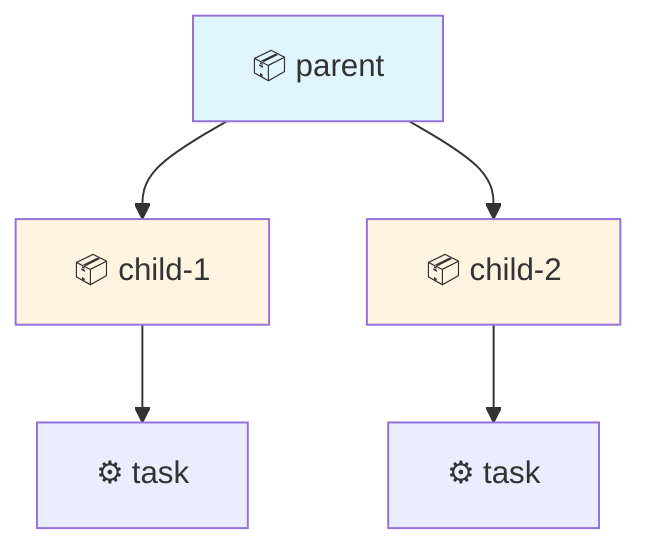

## What is Structured Concurrency?

Structured concurrency is a programming paradigm that treats concurrent operations as having a defined lifetime, similar to how structured programming treats control flow. Just as `if` statements and loops have clear entry and exit points, structured concurrency ensures that concurrent tasks have well-defined scopes.

### The Problem with Traditional Concurrency

Traditional JavaScript concurrency using bare Promises can lead to:

```typescript
// ❌ Unstructured concurrency - potential resource leaks
async function fetchUserData(userId: string) {
  const dataPromise = fetch(`/api/user/${userId}`);
  const settingsPromise = fetch(`/api/settings/${userId}`);
  
  // If an error occurs here, promises may still be running
  const data = await dataPromise;
  return data;
  // settingsPromise is abandoned - potential resource leak!
}
```

**Problems:**
- No automatic cleanup when parent function exits
- Abandoned promises keep running in the background
- No unified cancellation mechanism
- Resource leaks and race conditions

### The Structured Concurrency Solution

With go-go-scope, all concurrent operations are bound to a **Scope** - a resource that owns all tasks spawned within it:

```typescript
import { scope } from 'go-go-scope';

// ✅ Structured concurrency - guaranteed cleanup
async function fetchUserData(userId: string) {
  await using s = scope(); // Scope automatically disposed at end of block
  
  const dataTask = s.task(async ({ signal }) => {
    const res = await fetch(`/api/user/${userId}`, { signal });
    return res.json();
  });
  
  const settingsTask = s.task(async ({ signal }) => {
    const res = await fetch(`/api/settings/${userId}`, { signal });
    return res.json();
  });
  
  const [dataErr, data] = await dataTask;
  if (dataErr) throw dataErr;
  
  return data;
  // ✅ settingsTask automatically cancelled when scope exits
  // ✅ All resources cleaned up in LIFO order
}
```

<Note>
The `await using` syntax (TypeScript 5.2+) ensures the scope is automatically disposed when the block exits, triggering cleanup of all spawned tasks.
</Note>

## Core Benefits

### 1. Automatic Resource Cleanup

Every scope guarantees cleanup of all resources in Last-In-First-Out (LIFO) order:

```typescript
await using s = scope();

s.onDispose(() => console.log('Cleanup 1'));
s.onDispose(() => console.log('Cleanup 2'));
s.onDispose(() => console.log('Cleanup 3'));

// When scope exits:
// Cleanup 3
// Cleanup 2  
// Cleanup 1
```

### 2. Cancellation Propagation

When a parent scope is cancelled, all child tasks are automatically cancelled:

```typescript
await using s = scope({ timeout: 1000 }); // Auto-cancel after 1 second

const task1 = s.task(async ({ signal }) => {
  // This task receives cancellation signal
  await longOperation(signal);
});

const task2 = s.task(async ({ signal }) => {
  // This task also receives cancellation signal
  await anotherOperation(signal);
});

// After 1 second, BOTH tasks are automatically cancelled
```

<Tip>
All tasks receive an `AbortSignal` that is automatically aborted when the parent scope exits or times out.
</Tip>

### 3. Hierarchical Scopes

Scopes can be nested to create parent-child relationships:

```typescript
await using parent = scope({ name: 'parent' });

const child1 = parent.createChild({ name: 'child-1' });
const child2 = parent.createChild({ name: 'child-2' });

child1.task(async () => {
  // Task in child scope
});

// When parent is disposed:
// 1. child2 is disposed (LIFO order)
// 2. child1 is disposed  
// 3. parent is disposed
```

**Visualization:**



### 4. Error Boundary

Scopes act as error boundaries - errors in tasks don't crash the entire program:

```typescript
await using s = scope();

const [err, result] = await s.task(async () => {
  throw new Error('Task failed');
});

if (err) {
  console.error('Task error:', err);
  // Handle error gracefully
}

// Scope continues to exist and can spawn more tasks
```

## Real-World Example: HTTP Request with Timeout

```typescript
import { scope } from 'go-go-scope';

async function fetchWithTimeout(url: string, timeoutMs: number) {
  // Create scope with automatic timeout
  await using s = scope({ timeout: timeoutMs });
  
  const [err, data] = await s.task(async ({ signal }) => {
    // Pass signal to fetch for cancellation
    const response = await fetch(url, { signal });
    return response.json();
  });
  
  if (err) {
    if (err.name === 'AbortError') {
      throw new Error(`Request timeout after ${timeoutMs}ms`);
    }
    throw err;
  }
  
  return data;
  // ✅ Fetch automatically cancelled if timeout exceeded
  // ✅ All resources cleaned up when scope exits
}

// Usage
try {
  const data = await fetchWithTimeout('https://api.example.com/data', 5000);
  console.log(data);
} catch (err) {
  console.error('Failed to fetch:', err);
}
```

<Warning>
Always pass the `signal` parameter to async operations (like `fetch`) to enable proper cancellation.
</Warning>

## Comparison with Other Approaches

<Tabs>
  <Tab title="Unstructured (Promises)">
    ```typescript
    // ❌ Manual cleanup, easy to leak resources
    let controller = new AbortController();
    
    try {
      const response = await fetch(url, { 
        signal: controller.signal 
      });
      return response.json();
    } finally {
      // Easy to forget cleanup
      controller.abort();
    }
    ```
  </Tab>
  
  <Tab title="Structured (go-go-scope)">
    ```typescript
    // ✅ Automatic cleanup, impossible to leak
    await using s = scope();
    
    const [err, data] = await s.task(async ({ signal }) => {
      const response = await fetch(url, { signal });
      return response.json();
    });
    
    // Automatic cleanup happens here
    ```
  </Tab>
</Tabs>

## Key Principles

1. **Scopes own tasks** - Every task belongs to exactly one scope
2. **Scopes are disposable** - Use `await using` for automatic cleanup
3. **Cancellation cascades** - Parent cancellation propagates to all children
4. **LIFO cleanup** - Resources disposed in reverse order of creation
5. **No orphaned work** - All concurrent work completes or is cancelled when scope exits

## Next Steps

<CardGroup cols={2}>
  <Card title="Scopes and Tasks" icon="box" href="/concepts/scopes-and-tasks">
    Deep dive into Scope and Task classes
  </Card>
  <Card title="Automatic Cleanup" icon="broom" href="/concepts/automatic-cleanup">
    Learn about disposal patterns and LIFO cleanup
  </Card>
  <Card title="Cancellation" icon="stop" href="/concepts/cancellation">
    Master cancellation propagation with AbortSignal
  </Card>
  <Card title="Quick Start" icon="rocket" href="/quickstart">
    Get started with go-go-scope in minutes
  </Card>
</CardGroup>